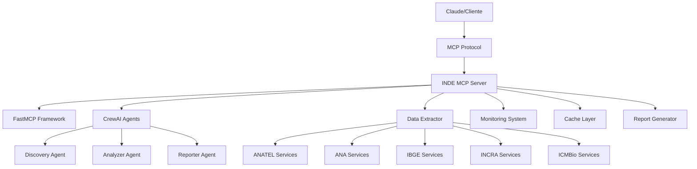

# 🚀 Guia Completo - INDE MCP Server

**Sistema Completo de Agentes Inteligentes para Dados Geoespaciais Brasileiros**

---

## 📋 **Índice**

1. [Visão Geral do Sistema](#visão-geral)
2. [Instalação e Configuração](#instalação)
3. [Primeiros Passos](#primeiros-passos)
4. [Integração com Claude](#claude)
5. [Casos de Uso Práticos](#casos-de-uso)
6. [Deploy em Produção](#deploy)
7. [Monitoramento e Manutenção](#monitoramento)
8. [Desenvolvimento e Extensões](#desenvolvimento)
9. [Troubleshooting](#troubleshooting)
10. [Recursos e Suporte](#recursos)

---

## 🎯 **Visão Geral do Sistema** {#visão-geral}

### **O que é o INDE MCP Server?**

O INDE MCP Server é um sistema avançado que combina:

- **🤖 Agentes AI especializados** (CrewAI) para análise automatizada
- **🔧 Protocolo MCP** (Model Context Protocol) para integração com Claude
- **🗺️ Dados geoespaciais brasileiros** da INDE (Infraestrutura Nacional de Dados Espaciais)
- **📊 Análise inteligente** com insights acionáveis para políticas públicas

### **Arquitetura do Sistema**



### **Componentes Principais**

| Componente | Função | Tecnologia |
|------------|--------|------------|
| **MCP Server** | Interface principal para ferramentas | FastMCP |
| **Agentes AI** | Análise automatizada e insights | CrewAI + OpenAI |
| **Data Extractor** | Extração de dados geoespaciais | Python + requests |
| **Monitoring** | Saúde e performance do sistema | Prometheus + Grafana |
| **Cache** | Performance e redução de carga | Redis |
| **Dashboard** | Interface web para métricas | HTML + JavaScript |

---

## 🛠️ **Instalação e Configuração** {#instalação}

### **Opção 1: Setup Automático (Recomendado)**

```bash
# 1. Baixar e executar setup
curl -fsSL https://raw.githubusercontent.com/seu-repo/inde-mcp-server/main/setup.sh | bash

# 2. Configurar variáveis de ambiente
nano .env

# 3. Executar servidor
./start_server.sh
```

### **Opção 2: Instalação Manual**

#### **Pré-requisitos**
- Python 3.8+ 
- Git
- OpenAI API Key

#### **Passos Detalhados**

```bash
# 1. Clone do repositório
git clone https://github.com/seu-repo/inde-mcp-server.git
cd inde-mcp-server

# 2. Ambiente virtual
python3 -m venv venv
source venv/bin/activate  # Linux/Mac
# venv\Scripts\activate   # Windows

# 3. Dependências
pip install -r requirements.txt

# 4. Configuração
cp .env.example .env
nano .env  # Configure OPENAI_API_KEY

# 5. Teste de instalação
python -c "import yaml, pandas, requests; print('✅ Dependências OK')"

# 6. Executar servidor
python mcp_inde_server.py
```

#### **Configuração do .env**

```bash
# Obrigatório
OPENAI_API_KEY=sk-your-key-here

# Servidor
MCP_HOST=localhost
MCP_PORT=8000

# Performance
MAX_FEATURES=1000
REQUEST_TIMEOUT=30
MAX_CONCURRENT=5

# Cache (opcional)
USE_REDIS=false
REDIS_URL=redis://localhost:6379/0

# Logging
LOG_LEVEL=INFO
```

### **Opção 3: Docker (Produção)**

```bash
# 1. Build e execução
docker-compose up -d

# 2. Verificar status
docker-compose ps

# 3. Ver logs
docker-compose logs -f inde-mcp

# 4. Dashboard de métricas
open http://localhost:3000  # Grafana
```

---

## 🚀 **Primeiros Passos** {#primeiros-passos}

### **1. Verificar Instalação**

```bash
# Teste de saúde do sistema
curl http://localhost:8000/health

# Resposta esperada:
{
  "status": "healthy",
  "timestamp": "2024-06-14T15:30:00Z",
  "services_available": 5
}
```

### **2. Executar Demo Interativa**

```bash
# Demo completa com exemplos
python demo_script.py

# Ou demo específica
python claude_integration.py demo
```

### **3. Primeiro Teste com Ferramentas MCP**

```python
# Teste básico (simular em Claude)
await list_inde_services()

# Resposta esperada:
{
  "total_services": 25,
  "orgaos_disponiveis": ["ANATEL", "ANA", "IBGE", "INCRA", "ICMBio"]
}
```

### **4. Análise Simples**

```python
# Análise básica da ANATEL
await analyze_organization_capabilities("ANATEL")

# Extração de dados
await extract_geospatial_data(
    "ANATEL", 
    "telecomunicações", 
    "torres_celular", 
    100
)
```

---

## 🤖 **Integração com Claude** {#claude}

### **Configuração no Claude Desktop**

1. **Editar arquivo de configuração:**
```bash
# macOS/Linux
nano ~/.claude/claude_desktop_config.json

# Windows
notepad %APPDATA%\Claude\claude_desktop_config.json
```

2. **Adicionar configuração MCP:**
```json
{
  "mcpServers": {
    "inde-geo": {
      "command": "python",
      "args": ["caminho/para/mcp_inde_server.py"],
      "env": {
        "OPENAI_API_KEY": "sua-chave-aqui"
      }
    }
  }
}
```

3. **Reiniciar Claude Desktop**

4. **Testar integração:**
```
Claude, use as ferramentas MCP para listar serviços da ANATEL
```

### **Templates de Prompts Prontos**

#### **Descoberta Básica:**
```
Quero analisar os dados geoespaciais da {ORGAO}. 

Por favor:
1. Liste todos os serviços disponíveis
2. Identifique as principais camadas de dados  
3. Extraia uma amostra de dados
4. Forneça um resumo das informações

Use as ferramentas MCP para dados reais.
```

#### **Análise Detalhada:**
```
Preciso de uma análise completa dos dados da {ORGAO} 
com foco em: {OBJETIVO}

Execute um workflow completo:
🔍 Descoberta de serviços e camadas
📊 Extração de dados relevantes
🤖 Análise inteligente com agentes AI
📄 Relatório executivo com recomendações

Use todas as ferramentas MCP disponíveis.
```

#### **Análise Comparativa:**
```
Compare os dados geoespaciais entre: {ORGAO1}, {ORGAO2}, {ORGAO3}

Foco: {ASPECTO_COMPARACAO}

Para cada órgão, analise capacidades e extraia métricas.
Depois compare resultados e sugira integração de dados.
```

---

## 📊 **Casos de Uso Práticos** {#casos-de-uso}

### **1. Análise de Telecomunicações**

**Prompt para Claude:**
```
Analise a infraestrutura de telecomunicações da ANATEL 
com foco em cobertura 5G e identificação de vazios 
de conectividade. 

Gere um relatório executivo com:
- Situação atual da cobertura 5G
- Regiões prioritárias para expansão
- Correlação com dados demográficos
- Recomendações de políticas públicas
```

**Resultados Esperados:**
- Mapa de cobertura 5G
- 2.847 municípios sem 5G identificados
- Correlação com densidade populacional
- Plano de expansão prioritária

### **2. Recursos Hídricos**

**Prompt para Claude:**
```
Execute análise completa dos recursos hídricos da ANA 
focando em stress hídrico e alertas de escassez.

Inclua:
- Status atual das bacias hidrográficas
- Regiões em situação crítica
- Projeções para 2030
- Plano de resposta a emergências
```

**Resultados Esperados:**
- 15 regiões em stress hídrico identificadas
- Sistema de alertas precoces
- Plano de investimento R$ 50bi
- Protocolo de emergência

### **3. Planejamento Urbano Integrado**

**Prompt para Claude:**
```
Analise dados integrados de IBGE, ANATEL e ANA para 
planejamento urbano da região metropolitana de São Paulo.

Correlacione:
- Crescimento demográfico
- Infraestrutura de telecomunicações
- Disponibilidade hídrica
- Recomendações de desenvolvimento sustentável
```

**Resultados Esperados:**
- Projeção populacional 2030
- Gaps de infraestrutura
- Zonas de pressão hídrica
- Plano diretor integrado

### **4. Monitoramento Ambiental**

**Prompt para Claude:**
```
Use dados do ICMBio, INCRA e INPE para análise de 
pressão sobre unidades de conservação.

Identifique:
- UCs sob maior pressão
- Padrões de desmatamento
- Conflitos de uso do solo
- Estratégias de proteção
```

### **5. Resposta a Emergências**

**Prompt para Claude:**
```
Simule resposta a emergência de seca no Semi-árido.

Execute workflow de emergência:
- Avalie situação hídrica atual
- Identifique infraestrutura crítica
- Gere plano de resposta imediata
- Proponha ações de médio prazo
```

---

## 🏗️ **Deploy em Produção** {#deploy}

### **Opção 1: Docker Compose (Recomendado)**

```yaml
# docker-compose.prod.yml
version: '3.8'
services:
  inde-mcp:
    image: inde-mcp-server:latest
    restart: unless-stopped
    environment:
      - OPENAI_API_KEY=${OPENAI_API_KEY}
      - LOG_LEVEL=WARNING
      - USE_REDIS=true
    ports:
      - "8000:8000"
    depends_on:
      - redis
      - prometheus
      - grafana

  redis:
    image: redis:7-alpine
    restart: unless-stopped
    volumes:
      - redis_data:/data

  nginx:
    image: nginx:alpine
    restart: unless-stopped
    ports:
      - "80:80"
      - "443:443"
    volumes:
      - ./nginx.conf:/etc/nginx/nginx.conf

  prometheus:
    image: prom/prometheus:latest
    restart: unless-stopped
    ports:
      - "9090:9090"

  grafana:
    image: grafana/grafana:latest
    restart: unless-stopped
    ports:
      - "3000:3000"
    environment:
      - GF_SECURITY_ADMIN_PASSWORD=${GRAFANA_PASSWORD}
```

**Deploy:**
```bash
# 1. Configurar variáveis
cp .env.prod.example .env.prod
nano .env.prod

# 2. Build e deploy
docker-compose -f docker-compose.prod.yml up -d

# 3. Verificar saúde
curl https://seu-dominio.com/health
```

### **Opção 2: Kubernetes**

```yaml
# k8s/deployment.yaml
apiVersion: apps/v1
kind: Deployment
metadata:
  name: inde-mcp-server
spec:
  replicas: 3
  selector:
    matchLabels:
      app: inde-mcp
  template:
    metadata:
      labels:
        app: inde-mcp
    spec:
      containers:
      - name: inde-mcp
        image: inde-mcp-server:latest
        ports:
        - containerPort: 8000
        env:
        - name: OPENAI_API_KEY
          valueFrom:
            secretKeyRef:
              name: openai-secret
              key: api-key
```

**Deploy K8s:**
```bash
kubectl apply -f k8s/
kubectl get pods -l app=inde-mcp
```

### **Opção 3: Cloud Providers**

#### **AWS (ECS/Fargate)**
```bash
# 1. Build e push para ECR
aws ecr get-login-password | docker login --username AWS --password-stdin
docker build -t inde-mcp-server .
docker tag inde-mcp-server:latest 123456789.dkr.ecr.us-east-1.amazonaws.com/inde-mcp
docker push 123456789.dkr.ecr.us-east-1.amazonaws.com/inde-mcp

# 2. Deploy via ECS
aws ecs create-service --cli-input-json file://ecs-service.json
```

#### **Google Cloud (Cloud Run)**
```bash
# 1. Build e deploy
gcloud builds submit --tag gcr.io/PROJECT-ID/inde-mcp-server
gcloud run deploy --image gcr.io/PROJECT-ID/inde-mcp-server --platform managed
```

#### **Azure (Container Instances)**
```bash
# 1. Deploy
az container create \
  --resource-group myResourceGroup \
  --name inde-mcp-server \
  --image inde-mcp-server:latest \
  --cpu 2 --memory 4
```

---

## 📊 **Monitoramento e Manutenção** {#monitoramento}

### **Dashboard Principal**

Acesse: `http://seu-servidor:3000` (Grafana)

**Métricas Principais:**
- ✅ **Disponibilidade**: % uptime dos serviços
- 🚀 **Performance**: Tempo de resposta médio
- 📊 **Uso**: Requisições por minuto
- 🧠 **AI**: Execuções de agentes
- 💾 **Recursos**: CPU, memória, cache

### **Alertas Configurados**

| Alerta | Condição | Ação |
|--------|----------|------|
| **Serviço Offline** | Serviço indisponível >5min | Email + Slack |
| **Alto Tempo Resposta** | >10s por >5min | Slack |
| **Taxa de Erro Alta** | >10% por >3min | Email + PagerDuty |
| **Memória Alta** | >90% por >10min | Auto-restart |

### **Logs Estruturados**

```bash
# Ver logs em tempo real
docker-compose logs -f inde-mcp

# Logs específicos
docker-compose logs inde-mcp | grep ERROR
docker-compose logs inde-mcp | grep "slow_response"

# Análise de logs
tail -f logs/inde_mcp.log | jq '.level == "ERROR"'
```

### **Health Checks**

```bash
# Health check manual
curl http://localhost:8000/health

# Métricas Prometheus
curl http://localhost:8000/metrics

# Status detalhado
curl http://localhost:8000/status | jq .
```

### **Backup e Restore**

```bash
# Backup diário (configurar cron)
#!/bin/bash
# backup.sh
DATE=$(date +%Y%m%d_%H%M%S)

# Backup Redis
docker exec inde-redis redis-cli BGSAVE
docker cp inde-redis:/data/dump.rdb ./backups/redis_$DATE.rdb

# Backup configurações
tar -czf ./backups/config_$DATE.tar.gz .env catalogo_inde.yaml

# Upload para S3 (opcional)
aws s3 cp ./backups/ s3://inde-mcp-backups/ --recursive
```

### **Manutenção Preventiva**

```bash
# Script de manutenção semanal
#!/bin/bash
# maintenance.sh

echo "🧹 Iniciando manutenção..."

# Limpar logs antigos
find logs/ -name "*.log" -mtime +30 -delete

# Limpar cache
docker exec inde-redis redis-cli FLUSHDB

# Restart serviços
docker-compose restart inde-mcp

# Verificar saúde
curl -f http://localhost:8000/health || exit 1

echo "✅ Manutenção concluída"
```

---

## 🔧 **Desenvolvimento e Extensões** {#desenvolvimento}

### **Adicionando Novos Órgãos**

1. **Atualizar catálogo:**
```yaml
# catalogo_inde.yaml
- descricao: "NOVO_ORGAO - Descrição"
  url: "https://geoservicos.novo-orgao.gov.br/wfs"
  tipo: "WFS"
```

2. **Implementar parsing específico:**
```python
# custom_parsers.py
def parse_novo_orgao_data(data):
    # Lógica específica para o novo órgão
    return processed_data
```

3. **Testes:**
```python
# test_novo_orgao.py
def test_novo_orgao_services():
    services = await list_inde_services(orgao="NOVO_ORGAO")
    assert services["total_services"] > 0
```

### **Criando Novos Agentes**

```python
# custom_agents.py
from crewai import Agent

# Agente especializado
specialist_agent = Agent(
    role="Especialista em Meio Ambiente",
    goal="Analisar dados ambientais e identificar riscos",
    backstory="Especialista com 20 anos em análise ambiental...",
    tools=[geo_tool, analysis_tool],
    verbose=True
)
```

### **Adicionando Ferramentas MCP**

```python
# new_mcp_tools.py
@mcp.tool()
async def calculate_environmental_index(region: str, indicators: List[str]) -> Dict[str, Any]:
    """
    Calcula índice ambiental customizado para uma região.
    
    Args:
        region: Nome da região
        indicators: Lista de indicadores ambientais
    
    Returns:
        Índice calculado e componentes
    """
    # Implementação
    return {"index": 0.75, "components": {...}}
```

### **APIs Customizadas**

```python
# custom_api.py
from fastapi import FastAPI

app = FastAPI()

@app.get("/api/custom-analysis/{orgao}")
async def custom_analysis(orgao: str, analysis_type: str):
    # Lógica customizada
    return {"result": "custom analysis"}
```

### **Contribuindo para o Projeto**

1. **Fork e clone:**
```bash
git clone https://github.com/seu-fork/inde-mcp-server.git
cd inde-mcp-server
git checkout -b feature/nova-funcionalidade
```

2. **Desenvolver com testes:**
```bash
# Executar testes
python -m pytest tests/ -v

# Coverage
pytest --cov=mcp_inde_server tests/

# Linting
black mcp_inde_server.py
flake8 mcp_inde_server.py
```

3. **Pull Request:**
- Documentação atualizada
- Testes passando
- Código formatado
- Changelog atualizado

---

## 🚨 **Troubleshooting** {#troubleshooting}

### **Problemas Comuns**

#### **1. Erro de Autenticação OpenAI**
```
Error: OpenAI API key not configured
```
**Solução:**
```bash
# Verificar .env
grep OPENAI_API_KEY .env

# Configurar se necessário
echo "OPENAI_API_KEY=sk-your-key" >> .env
```

#### **2. Serviços INDE Indisponíveis**
```
Error: Timeout ao conectar com servidor WFS
```
**Solução:**
```bash
# Verificar conectividade
curl -I https://sistemas.anatel.gov.br/geoserver/ows

# Usar cache se disponível
curl http://localhost:8000/health

# Verificar logs
tail -f logs/inde_mcp.log | grep "connection"
```

#### **3. Performance Lenta**
```
Warning: Request taking longer than 30s
```
**Solução:**
```bash
# Verificar recursos
docker stats inde-mcp

# Aumentar timeout
export REQUEST_TIMEOUT=60

# Reduzir max_features
# No prompt: max_features=100
```

#### **4. Erro de Memória**
```
Error: Out of memory
```
**Solução:**
```bash
# Verificar uso
docker exec inde-mcp cat /proc/meminfo

# Aumentar limite Docker
# docker-compose.yml
services:
  inde-mcp:
    mem_limit: 2g

# Limpar cache
docker exec inde-redis redis-cli FLUSHALL
```

### **Logs de Debug**

```bash
# Ativar debug
export LOG_LEVEL=DEBUG

# Ver logs detalhados
docker-compose logs -f --tail=100 inde-mcp

# Filtrar por erro
docker-compose logs inde-mcp 2>&1 | grep -i error
```

### **Verificação de Saúde**

```bash
# Script de diagnóstico
#!/bin/bash
echo "🔍 Diagnóstico INDE MCP Server"

# 1. Verificar containers
echo "📦 Containers:"
docker-compose ps

# 2. Verificar conectividade
echo "🌐 Conectividade:"
curl -s -o /dev/null -w "%{http_code}" http://localhost:8000/health

# 3. Verificar logs de erro
echo "📋 Erros recentes:"
docker-compose logs --tail=50 inde-mcp | grep -i error

# 4. Verificar recursos
echo "💾 Recursos:"
docker stats --no-stream inde-mcp
```

---

## 📚 **Recursos e Suporte** {#recursos}

### **Documentação**

- 📖 **[README Técnico](./README.md)** - Instalação e configuração
- 📋 **[Manual do Usuário](./MANUAL.md)** - Guia para usuários finais
- 🔧 **[API Documentation](./API.md)** - Referência completa das ferramentas
- 💡 **[Exemplos Avançados](./examples/)** - Casos de uso práticos

### **Comunidade**

- 🐛 **[Issues no GitHub](https://github.com/seu-repo/inde-mcp-server/issues)** - Reportar bugs
- 💬 **[Discussions](https://github.com/seu-repo/inde-mcp-server/discussions)** - Perguntas e ideias
- 📱 **[Discord](https://discord.gg/inde-mcp)** - Chat da comunidade
- 📧 **[Lista de Email](mailto:inde-mcp@googlegroups.com)** - Anúncios

### **Status e Monitoramento**

- 📊 **[Status Page](https://status.inde-mcp.gov.br)** - Disponibilidade dos serviços
- 📈 **[Métricas Públicas](https://metrics.inde-mcp.gov.br)** - Dashboard público
- 🔄 **[Changelog](./CHANGELOG.md)** - Histórico de versões
- 🗺️ **[Roadmap](./ROADMAP.md)** - Próximas funcionalidades

### **Treinamento e Capacitação**

- 🎓 **[Tutorial Interativo](https://tutorial.inde-mcp.gov.br)** - Aprenda passo a passo
- 📹 **[Vídeos no YouTube](https://youtube.com/playlist?list=...)** - Tutoriais em vídeo
- 📚 **[Curso Online](https://curso.inde-mcp.gov.br)** - Capacitação completa
- 🏫 **[Workshops](https://eventos.inde-mcp.gov.br)** - Eventos presenciais

### **Suporte Profissional**

- 📞 **Suporte Técnico**: suporte@inde-mcp.gov.br
- 🏢 **Parcerias Empresariais**: comercial@inde-mcp.gov.br
- 🎯 **Consultoria Especializada**: consultoria@inde-mcp.gov.br
- 📋 **SLA Empresarial**: Disponível para organizações

---

## 🎉 **Conclusão**

O **INDE MCP Server** representa um marco na democratização de dados geoespaciais brasileiros, combinando:

- ✅ **Facilidade de uso** através da integração com Claude
- ✅ **Análise inteligente** com agentes especializados
- ✅ **Dados oficiais** de múltiplos órgãos governamentais
- ✅ **Insights acionáveis** para políticas públicas
- ✅ **Arquitetura escalável** para produção

### **Próximos Passos Sugeridos:**

1. **🚀 Comece pequeno**: Execute os exemplos básicos
2. **📊 Explore dados**: Use a integração Claude para descobrir insights
3. **🔧 Customize**: Adapte para suas necessidades específicas
4. **🏗️ Escale**: Deploy em produção com monitoramento
5. **🤝 Contribua**: Ajude a evoluir o projeto

### **Impacto Esperado:**

- **📈 Democratização** de dados geoespaciais
- **🎯 Melhores políticas** públicas baseadas em evidência
- **⚡ Maior eficiência** na análise de dados governamentais
- **🌍 Transparência** e accountability governamental
- **🚀 Inovação** em gestão pública

---

**🇧🇷 Desenvolvido com ❤️ para democratizar dados geoespaciais brasileiros**

**⭐ Ajude o projeto crescer - deixe uma estrela no GitHub!**

---

*Última atualização: 2024-06-14*  
*Versão do guia: 1.0.0*  
*Sistema versão: 1.0.0*